# 📸 Capturas de Pantalla — SGV

> Las capturas se almacenan en `assets/screenshots/`.  
> Para agregar una nueva, colocala ahí y referenciala en la sección correspondiente.

---

## Autenticación

### Login

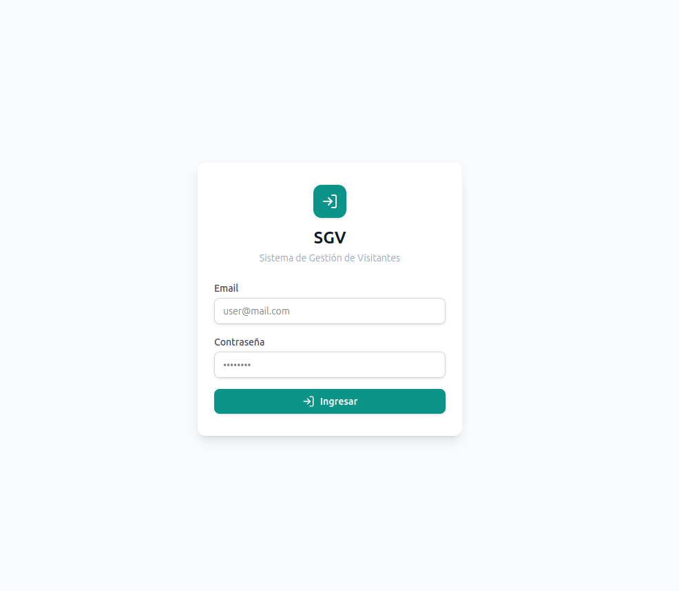
_Pantalla de inicio de sesión._

---

## Administración

### Gestión de Usuarios

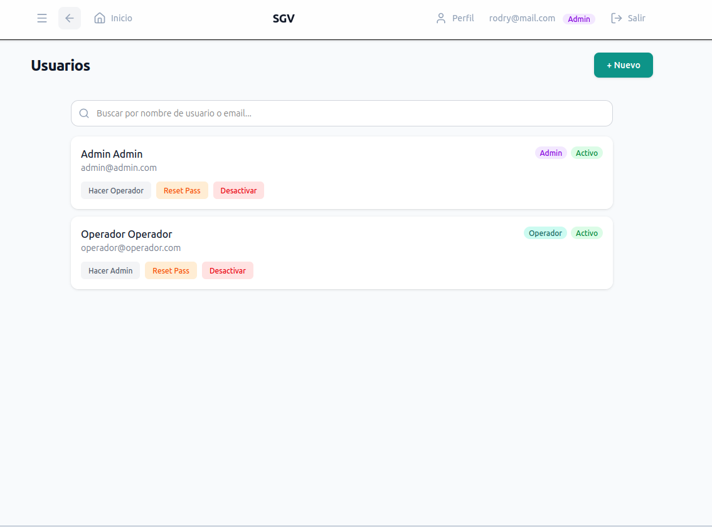
_ABM de operadores del sistema (solo ADMIN)._

---

## Personas

### Listado de Personas

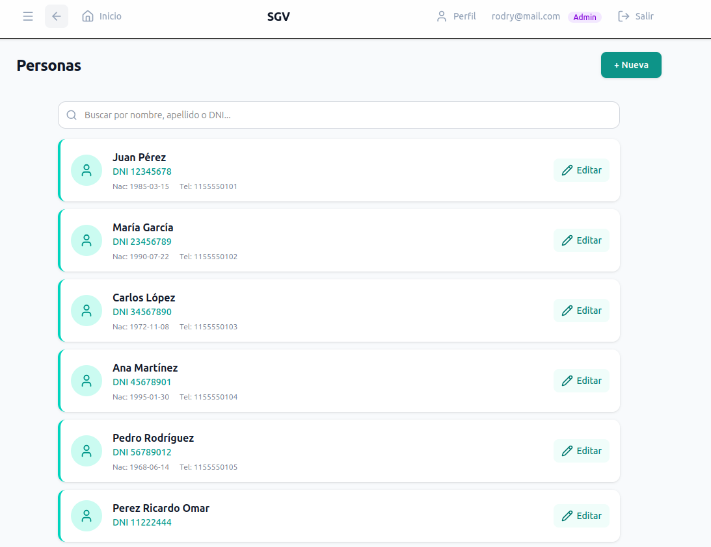
_Listado con búsqueda y paginación._

---

## Internación

### Servicios de Internación

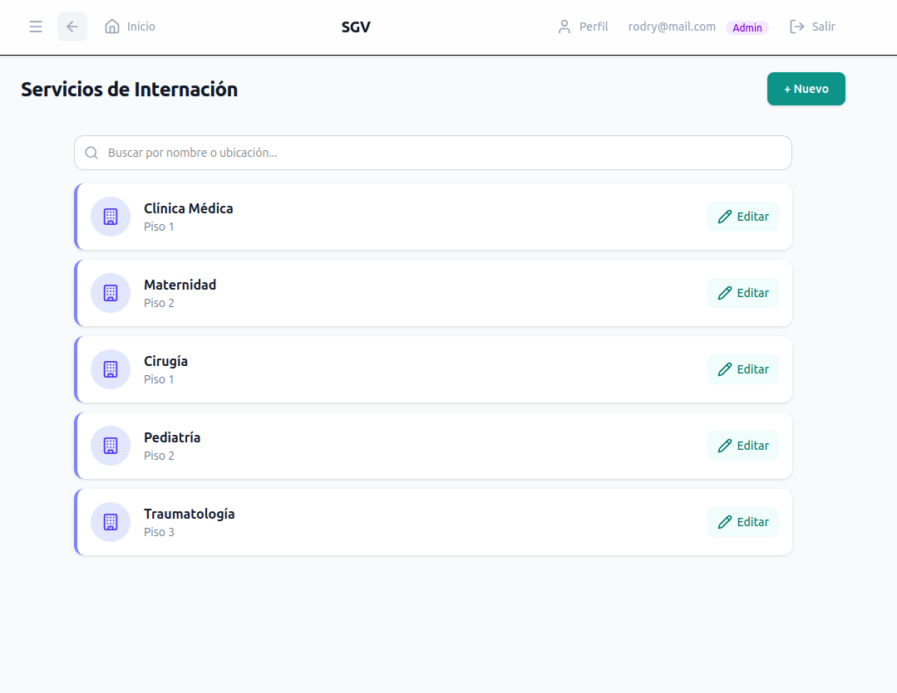
_Catálogo de servicios con camas._

### Camas

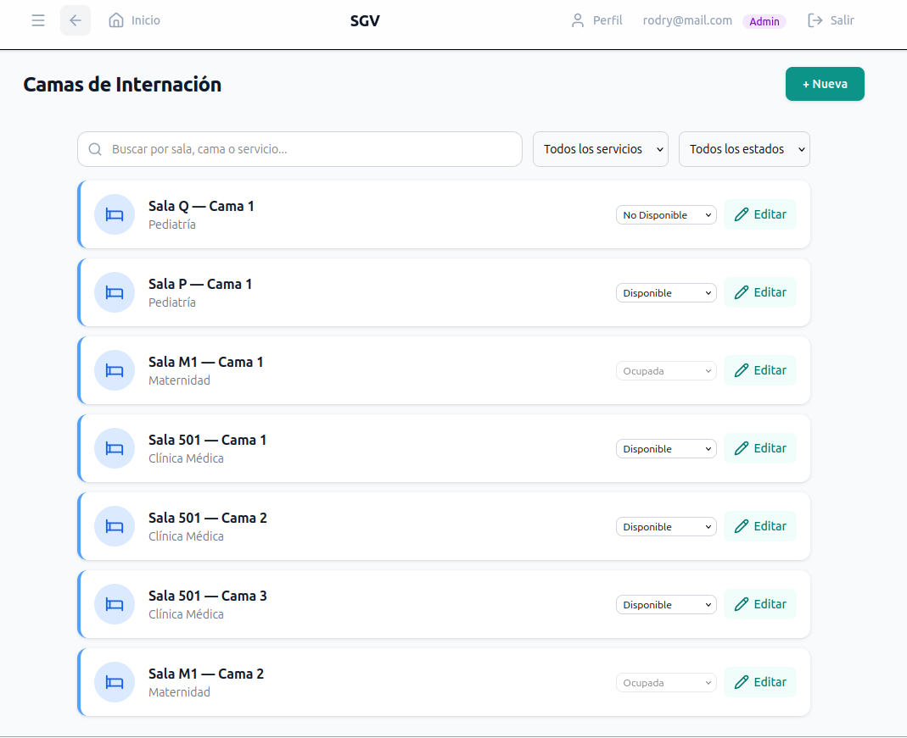
_Listado de camas con filtros por servicio y estado._

---

## Ocupación

### Pacientes Internados

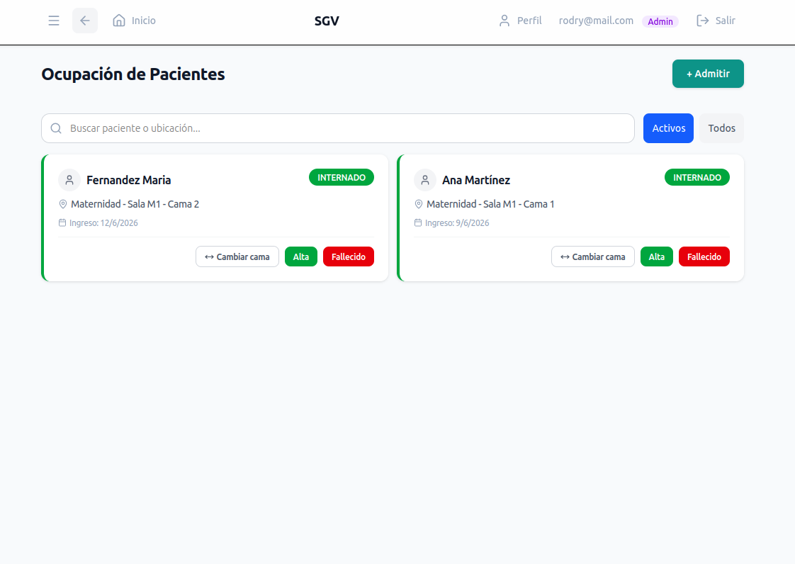
_Vista de pacientes activos con acciones (alta, fallecimiento, cambio de cama)._

### Admitir Paciente

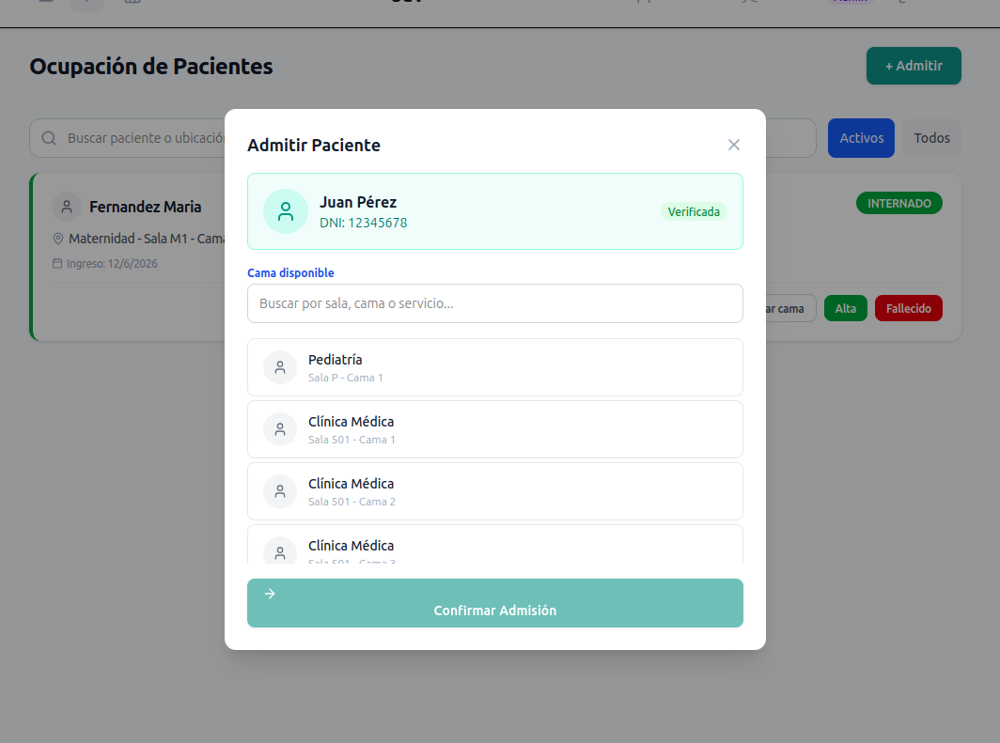
_Modal de admisión con búsqueda por DNI y selección de cama._

---

## Portería

### Dashboard de Portería

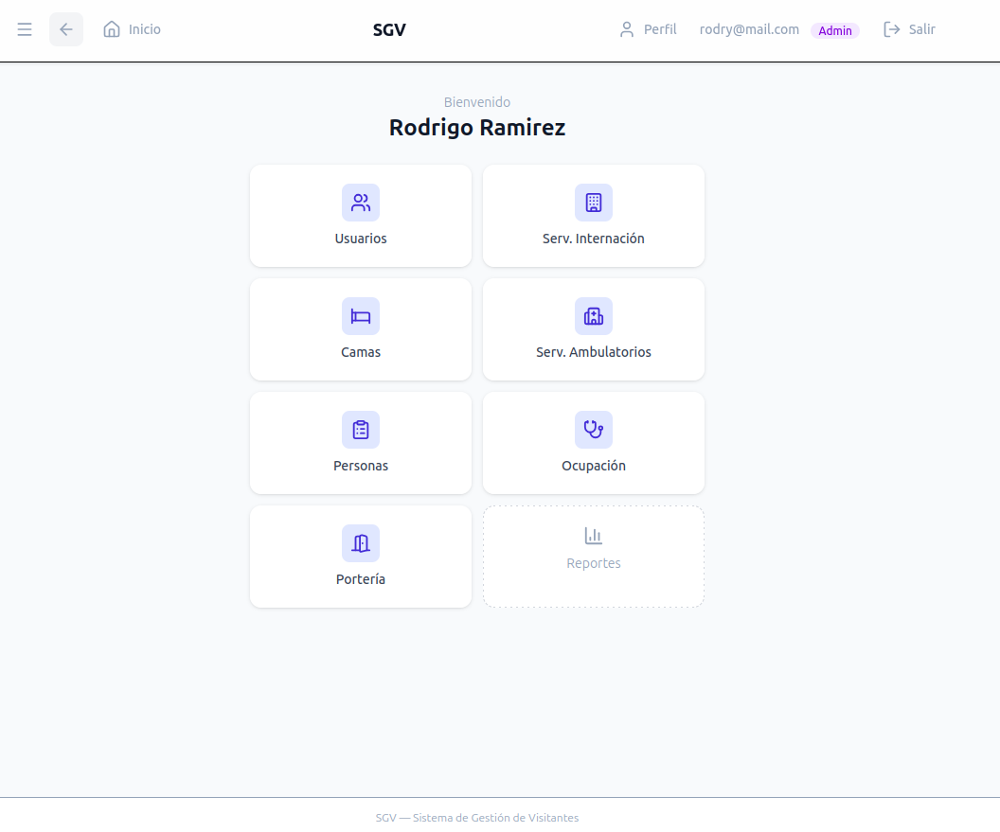
_Menú principal del módulo de portería._

### Ingreso a Internación

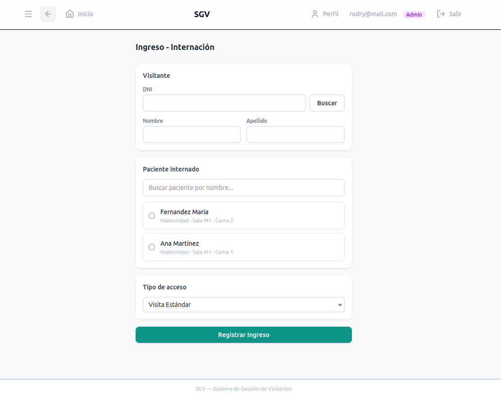
_Registro de visita a paciente internado._

### Ingreso Ambulatorio

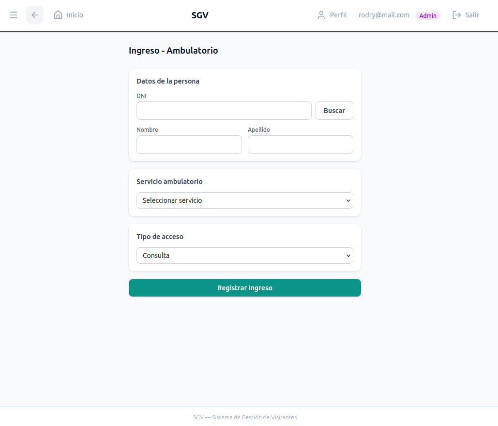
_Registro de ingreso a servicio ambulatorio._

### Visitantes Activos

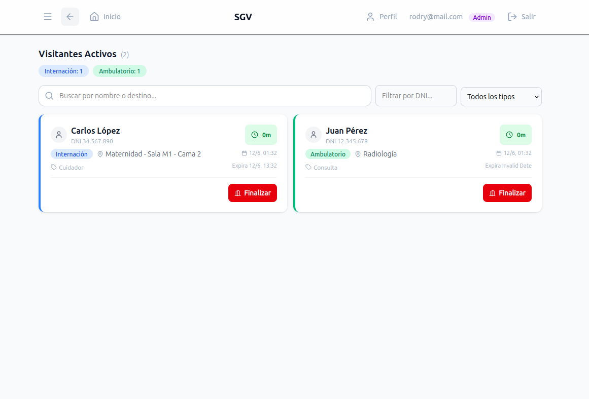
_Listado en tiempo real de visitas en curso._

---

## Perfil

### Mi Perfil

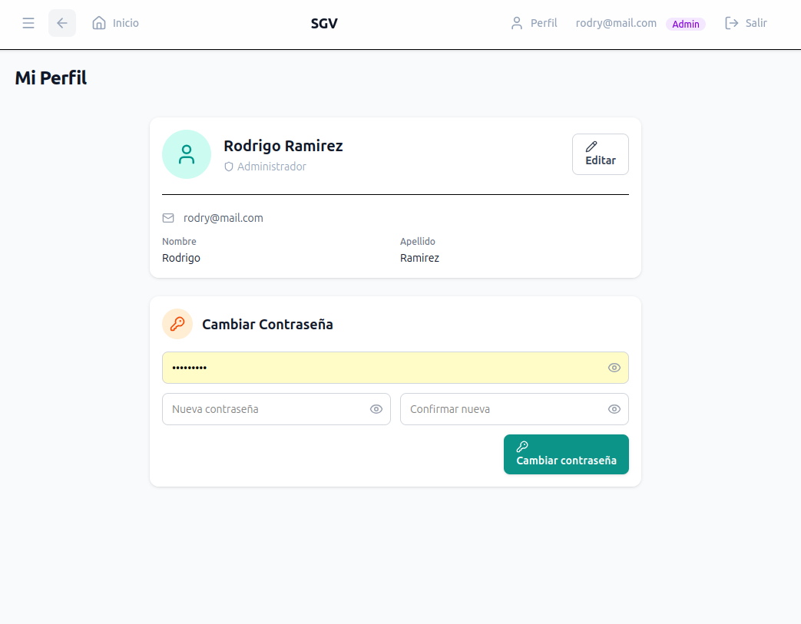
_Vista de perfil con opciones de editar datos y cambiar contraseña._
